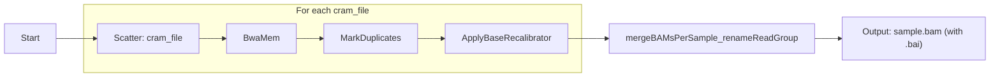
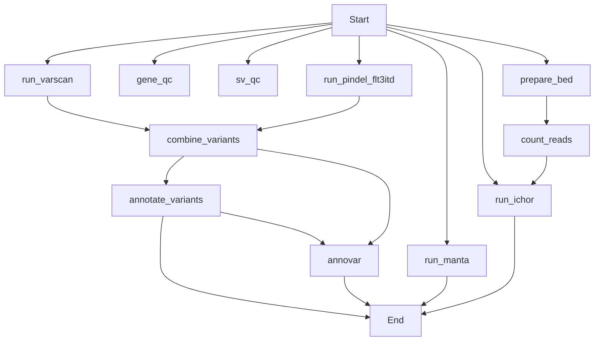

- `prepareBAM`: inital alignment, recalibration and merging of per sample CRAM files
- `chromoseq`: variant calling workflow
- `workflow_scripts`: helper scripts in chromoseq WDL
- `input_files`: static data files used for chromoseq
- `organize_output.sh`: group output files from chromoseq into per sample directory
- `analysis.ipynb`: generate the final output TSV file with annotation
- `04.14.csv`: gene panel annotation per sample

## prepareBAM workflow


## Chromoseq_custom workflow


### Helping code snippets
```
## Reference fasta file
/fh/fast/paguirigan_a/pub/ReferenceDataSets/genome_data/human/hg38/Gencode_GRCh38.primary_assembly.genome.fa

## Building Annovar Database
ml annovar/20200607-GCCcore-11.2.0-Perl-5.34.0

protocols=("refGene" "knownGene" "cosmic70" "esp6500siv2_all" "clinvar_20180603" "gnomad211_exome")
for prot in ${protocols[@]};do
	annotate_variation.pl --buildver hg38 --downdb --webfrom annovar $prot humandb/
done

table_annovar.pl RO20053_JR-WGS_230705_A00613_0568_BHW3JTDSX5.combined_variants_tagged.vcf.gz humandb/ \
	--buildver hg38 --out anno --remove \
	--protocol refGene,knownGene,cosmic70,esp6500siv2_all,clinvar_20180603,gnomad211_exome \
	--operation g,f,f,f,f,f --nastring . --vcfinput --nopolish
```